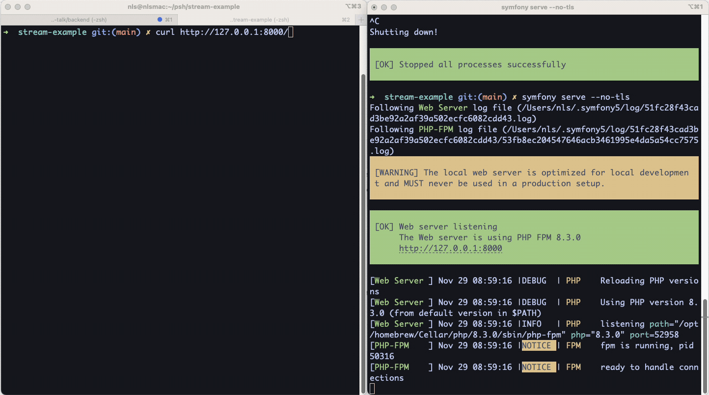

# Stream issue with symfony CLI

1. Clone the project
2. Launch `symfony serve --no-tls`
3. Request curl http://127.0.0.1:8000/

Instead of streaming the chunks, the response is only available when all is completed.

Code is in `src/Controller/ExampleController.php`

See the recording:

